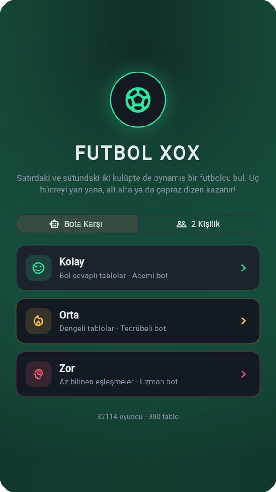
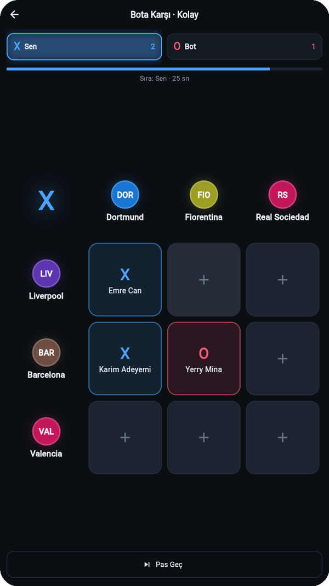
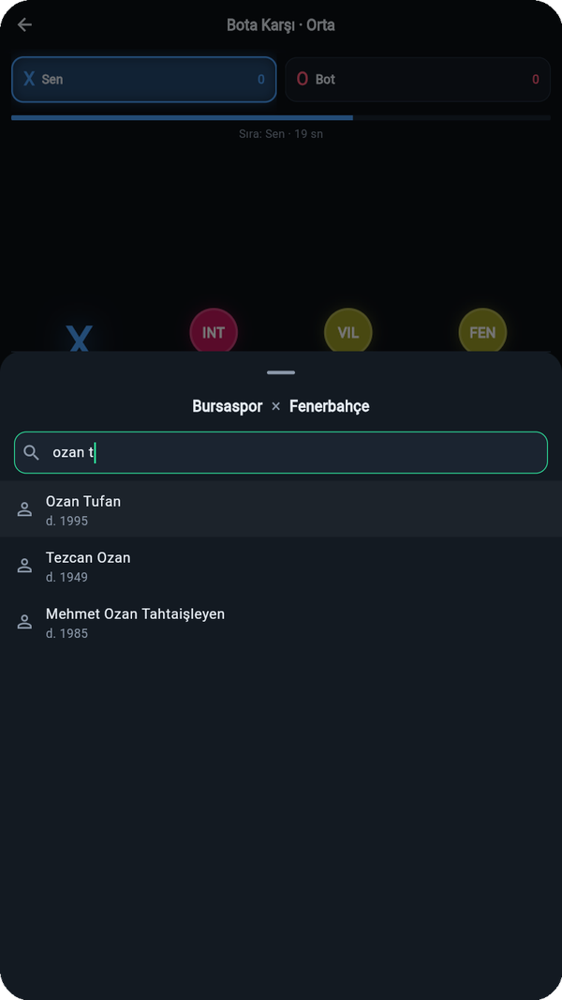

# ⚽ Futbol XOX

Tic-tac-toe mantığında bir futbol bilgi oyunu. Tablonun satırlarında ve sütunlarında kulüpler var; bir hücreyi almak için **o satırdaki ve sütundaki iki kulüpte de oynamış bir futbolcuyu** bulman gerekiyor. Üç hücreyi yan yana, alt alta ya da çapraz dizen kazanır.


## Ekran Görüntüleri

| Ana Menü | Oyun | Oyuncu Arama |
|:---:|:---:|:---:|
|  |  |  |

## Özellikler

- **32.000+ futbolcu**, 53 kulüp (Süper Lig ve Avrupa'nın 5 büyük ligi) ve **900 hazır tablo**
- **Bota karşı mod:** Üç seviyeli yapay zeka rakip. Bot, seviyesine göre farklı sayıda oyuncu "bilir", bazen unutur, bazen yanılır, kazanma fırsatlarını ve rakibini bloklamayı seviyesine göre görür
- **2 kişilik mod:** Aynı telefonda elden ele oyun
- **Akıllı arama:** Türkçe karakter ve aksanlardan bağımsız, kelime başı eşleşmesi ("slim" → Islam Slimani, "mkhit" / "mhit" → Mkhitaryan)
- **Kurallar:** Hamle başına 30 saniye, aynı oyuncu bir maçta tekrar kullanılamaz, 6 tur üst üste doğru cevap gelmezse beraberlik
- Oyun sonunda boş kalan hücreler için **örnek doğru cevaplar**
- Gece maçı temalı **koyu arayüz**

## Proje Yapısı

```
futbol_xox/
├── lib/
│   ├── data/          # Veri modelleri, yükleme ve arama
│   ├── game/          # Oyun kuralları ve yapay zeka rakip
│   ├── screens/       # Ana menü ve oyun ekranı
│   ├── widgets/       # Tahta, kulüp rozetleri, arama paneli
│   └── theme.dart     # Renk paleti ve tema
├── assets/data/       # Uygulamanın kullandığı hazır veri (JSON)
└── tools/             # Veri hattı (Python)
```

## Veri Hattı

Oyunun verisi, `tools/` klasöründeki Python scriptleriyle iki açık kaynaktan üretilir:

| Script | Görevi |
|---|---|
| `veri_topla.py` | Wikidata'dan 53 kulübü eşleştirir ve bu kulüplerde oynamış tüm futbolcuları çeker (eski dönem ve efsaneler için güçlü) |
| `tm_birlestir.py` | Transfermarkt veri setiyle birleştirir (2012 sonrası ve güncel transferler). Eşleştirme, Wikidata'daki Transfermarkt ID'leri üzerinden birebir yapılır |
| `tablo_uret.py` | Her hücrede en az 3 doğru cevap olan, zorluk seviyelerine ayrılmış tablolar üretir |
| `hazirla.py` | İngilizce isimleri ekler, kulüp adlarını kısaltır ve dosyaları `assets/data/` klasörüne yazar |

Veriyi yeniden üretmek için (`tools/` klasöründe):

```bash
pip install requests
python veri_topla.py
python tm_birlestir.py   # tools/tm_data/ içinde Transfermarkt CSV'leri gerekir
python tablo_uret.py
python hazirla.py
```

## Çalıştırma

```bash
flutter pub get
flutter run
```

## Yol Haritası

- [x] Veri hattı (Wikidata + Transfermarkt)
- [x] 2 kişilik mod
- [x] Yapay zeka rakip
- [x] Koyu tema
- [ ] Online mod (Firebase): eşleştirme, arkadaş odası, sunucu tarafı cevap kontrolü
- [ ] Liderlik tablosu ve rütbe sistemi
- [ ] Günün bulmacası
- [ ] Google Play ve App Store yayını

## Veri Kaynakları

- [Wikidata](https://www.wikidata.org/) — CC0 lisanslı
- [Football Data from Transfermarkt](https://www.kaggle.com/datasets/davidcariboo/player-scores) ([transfermarkt-datasets](https://github.com/dcaribou/transfermarkt-datasets)) — CC0 lisanslı

Bu proje hiçbir kulüp, lig veya Transfermarkt ile bağlantılı değildir. Kulüp ve oyuncu isimleri yalnızca bilgi amaçlı kullanılmıştır; resmi logo veya görsel kullanılmamaktadır.

## Geliştirici

**Muaz Onurluer** · [@muzosan](https://github.com/muzosan)
